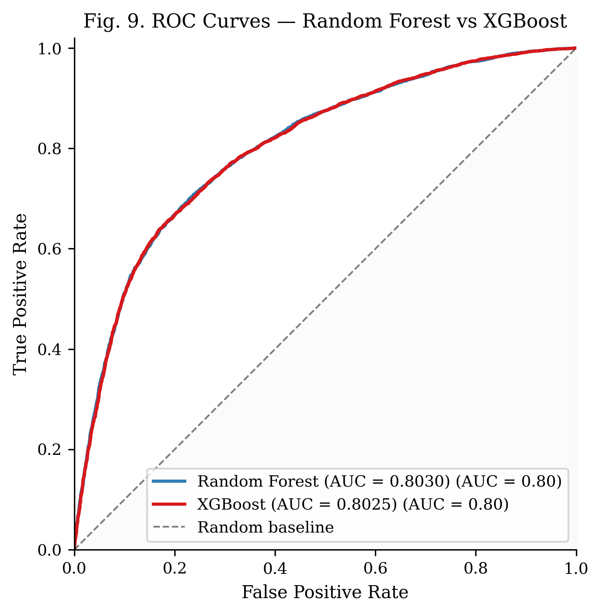
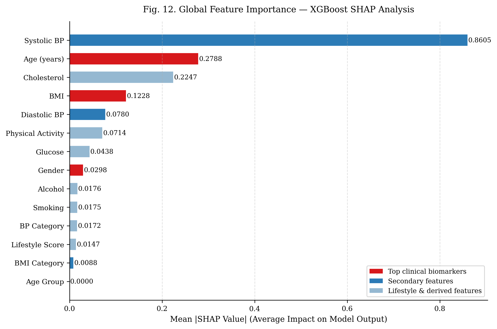
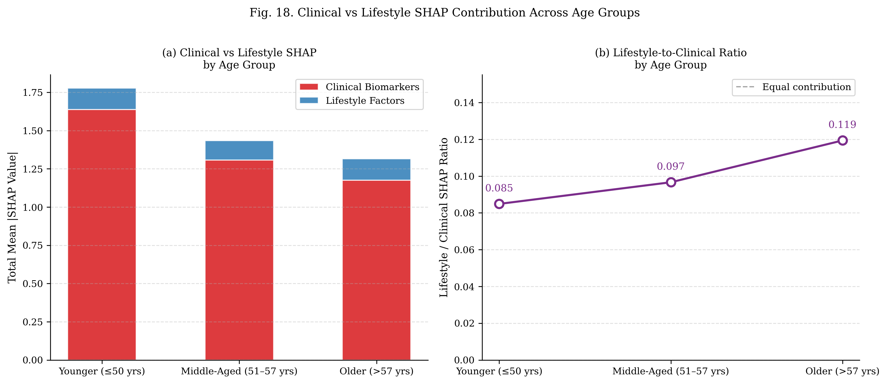

# CVD Risk Classification with Explainable AI 🫀

> Comparing Random Forest and XGBoost for cardiovascular 
> disease prediction, with SHAP-based age-stratified 
> explainability analysis across 68,489 patient records

## 📊 Key Results

| Model | Accuracy | F1-Score | ROC-AUC |
|-------|----------|----------|---------|
| Random Forest | 0.7347 | 0.7341 | 0.8030 |
| XGBoost | 0.7335 | 0.7329 | 0.8025 |

> XGBoost selected for SHAP analysis based on superior 
> CV stability (F1 = 0.7353 ± 0.0052 vs 0.7328 ± 0.0058)

## 🎯 Research Questions
1. Can ensemble ML achieve clinically meaningful CVD 
   classification (ROC-AUC > 0.80)?
2. Which features dominate — clinical biomarkers or 
   lifestyle factors?
3. Do risk factor contributions shift across age groups?

## 🔍 Key Findings

### 1. Both Models Exceed Clinical Threshold

The ROC curve compares how well each model distinguishes between CVD and non-CVD patients across all possible decision thresholds. A perfect model scores AUC = 1.0; a random guess scores 0.5.

Both Random Forest (AUC = 0.8030) and XGBoost (AUC = 0.8025) exceed the clinically meaningful threshold of 0.80, meaning the models correctly rank a random CVD patient above a random non-CVD patient 80% of the time.

The two curves are nearly identical and visually overlap — confirming that neither model has a meaningful advantage in overall discriminative ability. The key differentiator is cross-validation stability, where XGBoost showed lower variance (std = 0.0052 vs 0.0058), making it the more reliable choice for deployment on unseen data.

---

### 2. Systolic BP Dominates Globally

This chart shows the global feature importance from SHAP (SHapley Additive exPlanations) applied to the XGBoost model. Each bar represents the average absolute SHAP value for that feature across all 13,698 test patients — the longer the bar, the more that feature influences the model's predictions on average.

**How to read it:**
- 🔴 Red bars = top clinical biomarkers
- 🔵 Blue bars = secondary features  
- 🩵 Light blue bars = lifestyle and derived features

**Key takeaways:**
- Systolic BP is the single most important predictor by a
  large margin — consistent with its established role as
  the primary CVD risk indicator in clinical guidelines
- BP Category (AHA staging) and Diastolic BP follow,
  confirming blood pressure dominates the model's decisions
- Lifestyle factors (Smoking, Alcohol, Physical Activity)
  rank lower at the population level — but their relative
  importance changes significantly across age groups
  (see age-stratified analysis below)
- The total SHAP contribution of all clinical biomarkers
  far exceeds that of lifestyle factors, confirming H2

### 3. Lifestyle Importance Increases With Age

The lifestyle-to-clinical SHAP ratio increases 
monotonically across age groups:
- Younger Adult (≤50 yrs): 0.085
- Middle-Aged (51–57 yrs): 0.097  
- Older Adult (>57 yrs):   0.119

## 🛠️ Tech Stack
- Python (pandas, scikit-learn, XGBoost, SHAP)
- Google Colab (GPU-accelerated training)
- Matplotlib / Seaborn (visualization)

## 📁 Dataset
[Cardiovascular Disease Dataset](https://www.kaggle.com/datasets/sulianova/cardiovascular-disease-dataset)  
N = 70,000 | Source: Kaggle (Sulianova, 2019)

## 📄 Paper
This project was written up as a conference paper.  
See `IN PROGRESS`

## 🚀 How to Run
# 1. Clone the repo
git clone https://github.com/ewiw24/cvd-risk-classification-shap

# 2. Install dependencies
pip install -r requirements.txt

# 3. Run notebooks in order (01 → 04)
# Or open directly in Google Colab
